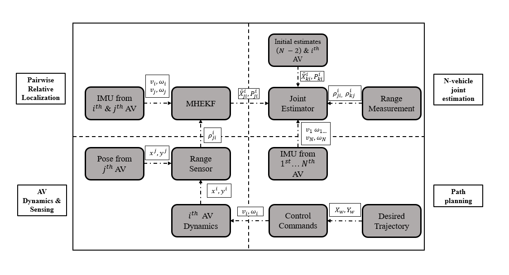

# Cooperative Relative Localization

In this project, we have created python codes to read data from multiple turtlebots on a single computer (using the ROS Master Slave configuration), read motion capture data and also read decawave radio data.
In the ***launch*** folder, two different launch files are provided. One is used to read data from the turtlebots. This file is kept separate as it can be used standalone to collect data for any offline experiement as well. The CooperativeRelativeEKF.launch is used to launch the sensor nodes, the EKF and the error calculation node. The file is setup in such a way that it can run on live data or it can run using previous bagged data.  
In the ***src*** folder, the different nodes are defined. From their names, these nodes are quite straight-forward.  
  ***1. inertial_pose_multiple_cls.py*** --> This node takes the true data from the MoCap system and turtlebot and converts it into a format with time headers. Additionally,   topics are created to ensure that the user has access to all relevant information using the same topic rather than needing to subscribe to multiple topics. This was done to avoid introducing time-desynchronization factors.  
  ***2. true_relative_pose_multiple_cls.py*** --> This node uses data from the inertial pose node to calculate the true relative pose between the turtlebots. This is used again in the error calculation node or if a relative pose measurement is used in the EKF.  
  ***3. sensor_meas_multiple_cls.py*** --> This node measures the range between the turtlebots. This node can be used with MoCap data or with any other range sensor (in this case, decawave) to compute the range measurements.
  ***4. relative_ekf_multiple_range_cls.py*** --> This is the cooperative relative localization node with EKF. There are different flags to allow and stop different measurements from being used by the EKF.  
  ***5. error_node_multiple_cls.py*** --> This node takes in the true states and estimated states and computes the errors.  
  
    
  

The simulation and experimental videos are found at 
